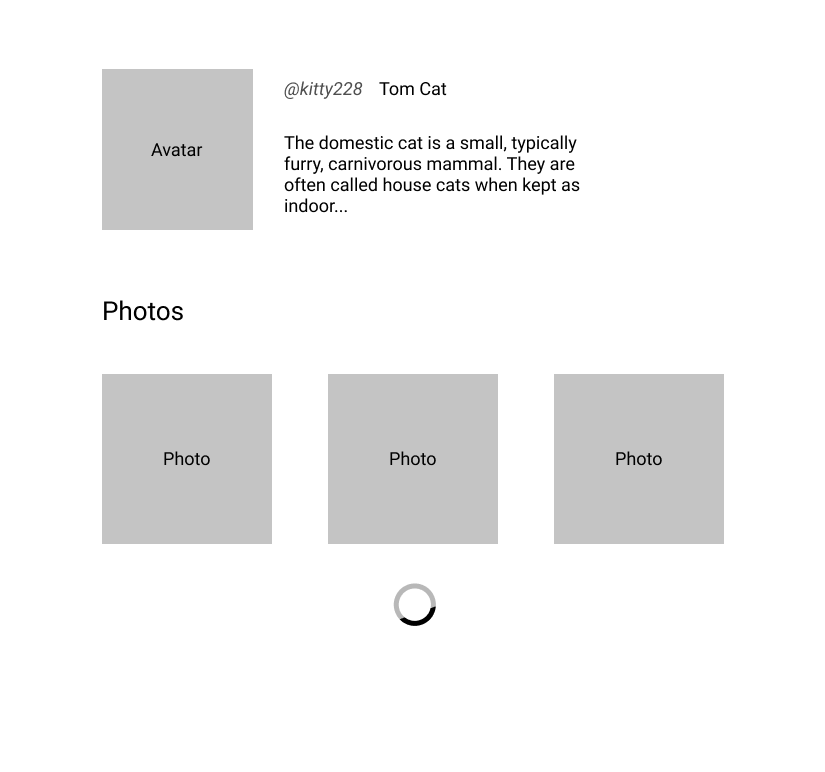

### Problem

 We have a profile page avatar photo, users name and photos with titles.



 data model looks like follow:

 ```javascript
 
 {
  login: "kitty228",
  name: "Tom Cat",
  about: "bla bla bla...",
  avatarUrl: "http://via.placeholder.com/80x80",
  photos: [
    {
      title: "Me and my friends",
      url: "http://via.placeholder.com/100x100"
    }
  ]
 }
```

photos should be loaded only when they are within viewport 
